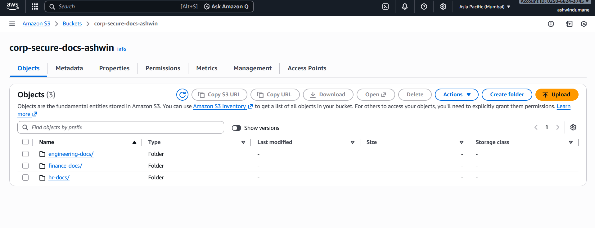
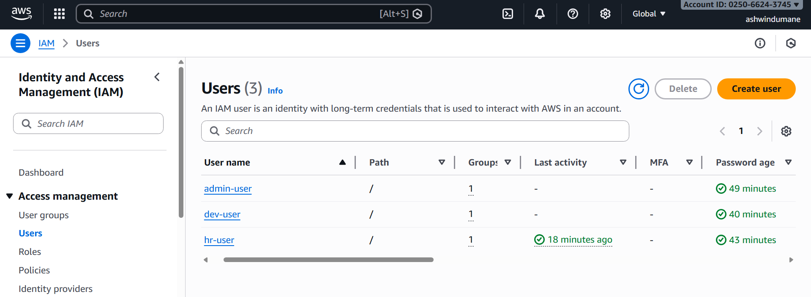
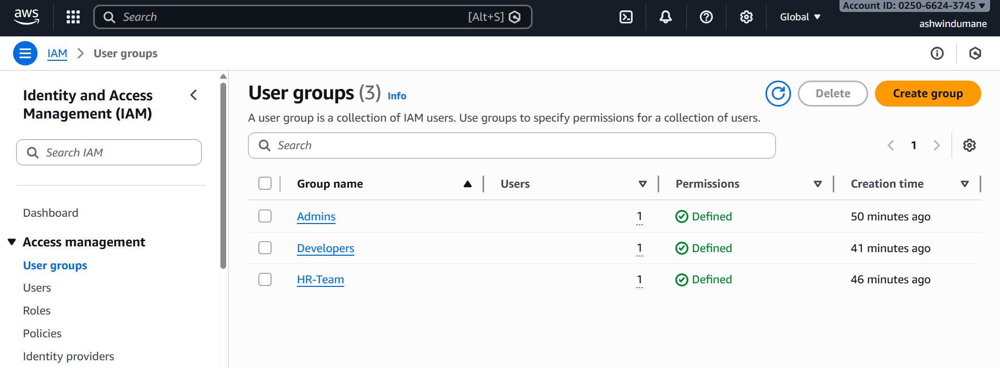
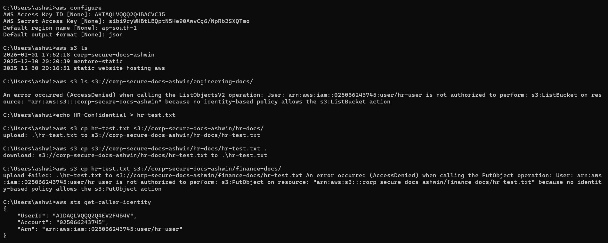

# Secure Corporate Document Management System using AWS IAM & S3

## Project Overview

This project demonstrates a **real-world, corporate-level implementation** of secure document management on AWS using **IAM and S3**, following **least privilege** and **enterprise security best practices**.

The solution ensures that different teams (HR, Developers, Admins) have **controlled and isolated access** to sensitive documents stored in Amazon S3.

---

## Project Screenshots

### 🔹 S3 Bucket Creation


---

### 🔹 IAM Users


---

### 🔹 IAM Groups


---

### 🔹 IAM Policies


---

### 🔹 AWS CLI Testing (Windows)


---

## 🎯 Business Use Case

Organizations often store sensitive documents such as:
- HR records
- Engineering documents
- Financial reports

This project ensures:
- No public access
- Role-based access control
- Auditable and secure storage

---

## 🔐 Access Control Design

| Role        | Permissions |
|------------|-------------|
| Admin      | Full S3 & IAM access |
| HR Team    | Read/Write access to `hr-docs/` only |
| Developers | Read-only access to `engineering-docs/` |
| Public     | ❌ No access |

---

## 📁 S3 Bucket Structure

corp-secure-docs-ashwin/
├── hr-docs/
├── finance-docs/
└── engineering-docs/

---

## 👤 IAM Configuration

### IAM Users
- admin-user
- hr-user
- dev-user

### IAM Groups
- Admins
- HR-Team
- Developers

Permissions are assigned **only to groups**, not directly to users.

---

## 📜 IAM Policies

Custom IAM policies are stored in the `policies/` directory:

- `hr-policy.json`  
  Grants HR users read/write access only to the `hr-docs/` folder.

- `developer-policy.json`  
  Grants Developers read-only access to the `engineering-docs/` folder.

Both policies enforce **least privilege** and include required permissions
for proper AWS S3 Console and CLI visibility.

---

## 🧪 Testing & Validation

### Console Testing
- HR user cannot see non-HR folders
- Developer user cannot upload files
- Unauthorized access returns **AccessDenied**

### AWS CLI Testing (Windows)

```bash
aws s3 ls
aws s3 ls s3://corp-secure-docs-ashwin/
aws s3 cp hr-test.txt s3://corp-secure-docs-ashwin/hr-docs/
